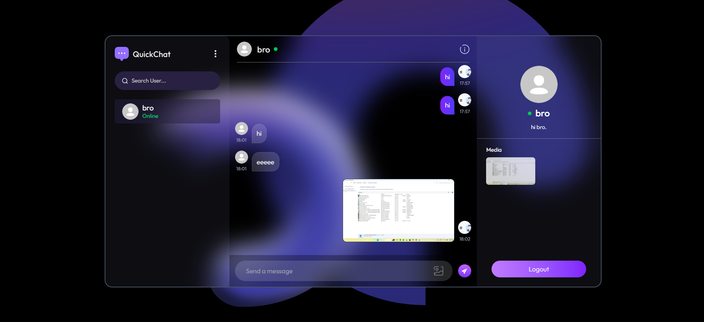
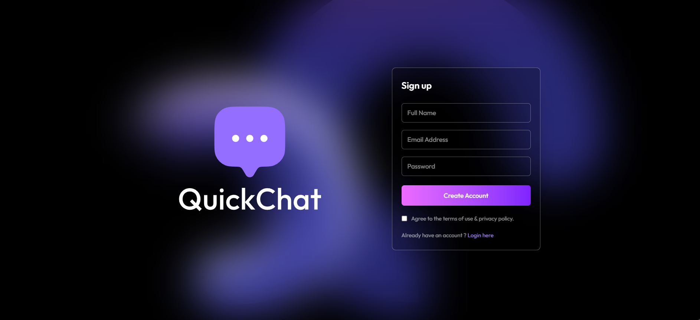
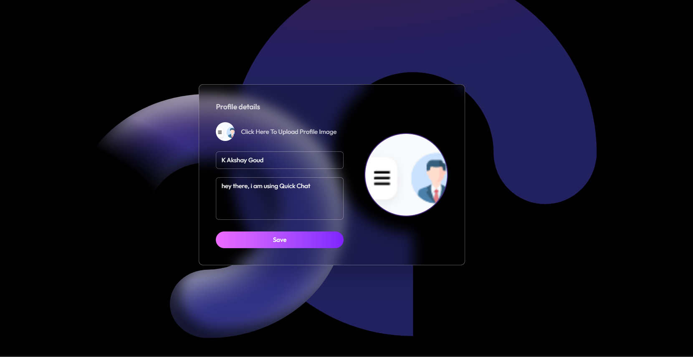
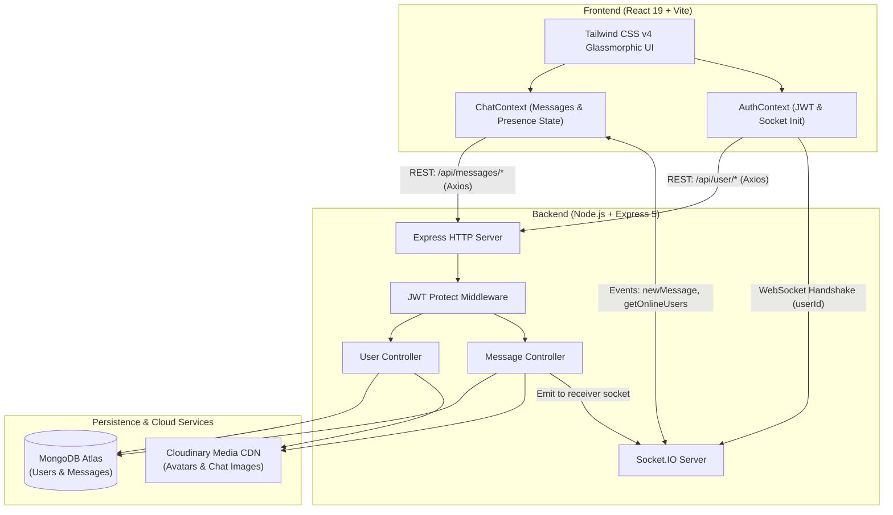
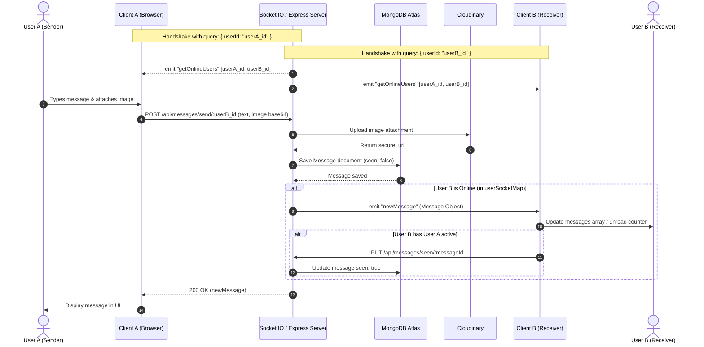

<div align="center">


# ⚡ QuickChat

### A modern, full-stack real-time messaging application built with the MERN stack and Socket.IO

[](https://react.dev/)
[](https://nodejs.org/)
[](https://expressjs.com/)
[](https://www.mongodb.com/)
[](https://socket.io/)
[](https://tailwindcss.com/)
[](https://cloudinary.com/)
[](https://jwt.io/)

<p align="center">
  <a href="#overview">Overview</a> •
  <a href="#key-features">Key Features</a> •
  <a href="#ui-showcase">UI Showcase</a> •
  <a href="#architecture">Architecture</a> •
  <a href="#tech-stack">Tech Stack</a> •
  <a href="#getting-started">Getting Started</a> •
  <a href="#api-reference">API Reference</a> •
  <a href="#websocket-events">WebSocket Events</a> •
  <a href="#project-structure">Project Structure</a>
</p>

</div>

---

<div align="center">
  
  <p><em>The QuickChat 3-panel workspace: real-time contact sidebar, active messaging thread with media attachments, and contact profile with shared media gallery.</em></p>
</div>

---

<a id="overview"></a>
## 📖 Overview

**QuickChat** is a production-ready, full-stack real-time messaging platform engineered to deliver private, instantaneous conversations with a fluid desktop and mobile user experience. Designed with a sleek dark-mode glassmorphic interface, QuickChat bridges responsive modern frontend design with high-performance event-driven backend communication.

Users can sign up, securely log in, customize their profile with Cloudinary-backed avatars, search through registered users, monitor who is currently online via real-time presence indicators, exchange rich text and image messages with zero latency, track unread message counts, and browse shared media directly from the conversation drawer.

---

<a id="milestone"></a>
## 💡 Developer Milestone: First WebSocket Project

> [!NOTE]
> **QuickChat represents my first deep dive into WebSockets and event-driven architectures.**

Prior to this project, web development primarily centered around conventional REST APIs relying on client-initiated request-and-response lifecycles. Real-time chat demanded a paradigm shift:
- **Bi-directional Communication**: Utilizing **Socket.IO** to maintain persistent full-duplex TCP connections between client and server.
- **Connection Lifecycle Management**: Tracking user handshakes with authenticated `userId` query parameters, managing an active in-memory socket registry (`userSocketMap`), and automatically handling reconnects and drops.
- **Real-Time Presence Broadcasting**: Instantly pushing online/offline presence updates to all connected clients upon connection and disconnection events.
- **Targeted Peer-to-Peer Event Routing**: Routing incoming messages directly to the recipient's active socket channel (`io.to(receiverSocketId).emit("newMessage", ...)`), guaranteeing instant message arrival without polling overhead.
- **Hybrid Data Flow**: Harmonizing RESTful persistence (MongoDB storage via Mongoose) with instant socket dispatch, ensuring message durability alongside sub-second delivery.

---

<a id="key-features"></a>
## ✨ Key Features

| Feature | Description |
| :--- | :--- |
| ⚡ **Instant Messaging** | Real-time 1-on-1 private messaging powered by Socket.IO with optimistic UI updates and instant delivery. |
| 🟢 **Live Online Presence** | Real-time detection and broadcasting of active online users with green status indicator badges. |
| 🔔 **Unread Message Badges** | Visual notification badges for unseen messages from specific contacts, automatically cleared upon opening the thread. |
| 📸 **Rich Media Sharing** | Send image attachments directly within conversations, processed and hosted globally via Cloudinary CDN. |
| 📁 **Shared Media Gallery** | Automatic aggregation of all photos exchanged between two users into a browsable conversation media drawer. |
| 🔍 **Live Contact Search** | Instant client-side filtering in the sidebar to rapidly find contacts by name. |
| 🔐 **JWT Authentication** | Secure signup and login flows with salted password hashing via `bcryptjs` and stateless JWT verification. |
| 👤 **Profile Customization** | Upload custom avatars to Cloudinary, update display names, and set personal bio statuses. |
| 🎨 **Glassmorphic Dark UI** | Crafted with Tailwind CSS v4 featuring translucent panels, glowing purple accents, and responsive design. |
| 🍞 **Toast Notifications** | Non-intrusive, interactive feedback alerts using `react-hot-toast` for authentication, updates, and network errors. |

---

<a id="ui-showcase"></a>
## 📸 UI Showcase

Here is a visual walkthrough of the QuickChat interface and user flow:

### 1. Authentication & Onboarding
The entry point features a glowing violet aesthetic with seamless toggling between account registration and user login. Includes client and server-side validation and password encryption.

<div align="center">
  
  <p><em>Sign up screen with clean glassmorphic card, input validation, and toggle to login.</em></p>
</div>

<br />

### 2. User Profile & Media Settings
Users can customize their digital identity by uploading a profile picture directly to Cloudinary with live preview, setting their display name, and updating their status bio.

<div align="center">
  
  <p><em>Profile management screen with Cloudinary avatar upload, live avatar preview, and bio configuration.</em></p>
</div>

<br />

### 3. Real-Time Conversation Workspace
The primary workspace combines three interconnected panels designed for optimal chat productivity:
- **Left Panel (Sidebar)**: QuickChat branding, contact search bar, online status indicators, and unread counters.
- **Center Panel (Chat Container)**: Message history, active peer header, sent/received message bubbles with timestamps, and an attachment-ready input field.
- **Right Panel (Contact Details & Media)**: Contact profile card with live status, personal bio, shared conversation media gallery grid, and quick logout.

<div align="center">
  
  <p><em>Comprehensive 3-panel chat interface showing live chat history, media attachments, and sidebar drawer.</em></p>
</div>

---

<a id="architecture"></a>
<a id="system-architecture"></a>
## 🏗️ System Architecture

QuickChat utilizes a decoupled client-server architecture combining REST APIs for CRUD operations and WebSockets for low-latency event propagation:



### Real-Time Event Flow



---

<a id="tech-stack"></a>
## 💻 Tech Stack

### Frontend

| Technology | Version | Purpose |
| :--- | :--- | :--- |
| **React** | `^19.2.8` | Core UI library using modern functional components and hooks |
| **Vite** | `^8.2.0` | Ultra-fast build tool and development server with HMR |
| **Tailwind CSS** | `^4.3.3` | Utility-first styling framework for glassmorphism and animations |
| **React Router DOM** | `^7.18.2` | Client-side routing and protected navigation |
| **Socket.IO Client** | `^4.8.3` | Bi-directional client communication and event listening |
| **Axios** | `^1.19.0` | Promise-based HTTP client with configured interceptors |
| **React Hot Toast** | `^2.6.0` | Lightweight and customizable toast notification system |

### Backend

| Technology | Version | Purpose |
| :--- | :--- | :--- |
| **Node.js** | `>=18` | Asynchronous JavaScript runtime environment (ES Modules) |
| **Express** | `^5.2.1` | REST API routing and HTTP request handling |
| **Socket.IO** | `^4.8.3` | Real-time WebSocket server engine and socket connection registry |
| **MongoDB / Mongoose** | `^9.9.3` | Document database and object data modeling (ODM) |
| **JSON Web Token (JWT)** | `^9.0.3` | Stateless authentication tokens passed via headers |
| **bcryptjs** | `^3.0.3` | Password hashing with cryptographic salting |
| **Cloudinary SDK** | `^2.10.1` | Cloud image storage, upload transformations, and CDN delivery |
| **dotenv** | `^17.4.2` | Environment variable management |
| **cors** | `^2.8.6` | Cross-Origin Resource Sharing middleware |

---

<a id="database-models"></a>
## 🗄️ Database Models

### User Schema (`backend/models/User.js`)

| Field | Type | Required | Default | Notes |
| :--- | :--- | :---: | :---: | :--- |
| `email` | `String` | Yes | - | Unique user email address |
| `fullName` | `String` | Yes | - | Display name of the user |
| `password` | `String` | Yes | - | Encrypted hash via `bcryptjs` (min 6 chars) |
| `profilePic` | `String` | No | `""` | Secure Cloudinary image URL |
| `bio` | `String` | No | - | User bio / status message |
| `createdAt` / `updatedAt` | `Date` | - | auto | Timestamps enabled |

### Message Schema (`backend/models/message.js`)

| Field | Type | Required | Default | Notes |
| :--- | :--- | :---: | :---: | :--- |
| `senderId` | `ObjectId` | Yes | - | Reference to `User` model |
| `receiverId` | `ObjectId` | Yes | - | Reference to `User` model |
| `text` | `String` | No | `""` | Text content of the message |
| `image` | `String` | No | `""` | Cloudinary URL for image attachments |
| `seen` | `Boolean` | No | `false` | Read receipt indicator |
| `createdAt` / `updatedAt` | `Date` | - | auto | Timestamps enabled |

---

<a id="websocket-events"></a>
## 🔌 WebSocket Events

The real-time layer operates over Socket.IO with the following event contracts:

| Event | Direction | Payload | Description |
| :--- | :---: | :--- | :--- |
| `connection` | Client ➔ Server | `query: { userId }` | Triggered when a client connects. The server associates `socket.id` with `userId` in `userSocketMap`. |
| `getOnlineUsers` | Server ➔ Clients | `string[]` (User IDs) | Broadcast to **all** connected clients whenever any user connects or disconnects. |
| `newMessage` | Server ➔ Client | `Message` Object | Emitted specifically to `receiverSocketId` when a message is sent to an online user. |
| `disconnect` | Client ➔ Server | - | Triggered on window close or network drop. Cleans up `userSocketMap` and broadcasts updated online list. |

---

<a id="api-reference"></a>
## 📡 API Reference

Base URL: `http://localhost:5000`

> [!IMPORTANT]
> All protected endpoints require a valid JWT token passed in the `token` request header:
> `token: <your_jwt_token>`

### Authentication & Profile (`/api/user`)

| Method | Endpoint | Access | Description | Request Body |
| :--- | :--- | :---: | :--- | :--- |
| `POST` | `/api/user/signup` | Public | Register a new user | `{ email, fullName, password, bio }` |
| `POST` | `/api/user/login` | Public | Authenticate existing user | `{ email, password }` |
| `GET` | `/api/user/check` | Protected | Verify current auth token | _None_ |
| `PUT` | `/api/user/updateprofile` | Protected | Update profile pic, name, bio | `{ fullName, bio, profilePic? }` |

### Messages & Contacts (`/api/messages`)

| Method | Endpoint | Access | Description | Request Body / Params |
| :--- | :--- | :---: | :--- | :--- |
| `GET` | `/api/messages/users` | Protected | Fetch all contacts & unread counts | _None_ |
| `GET` | `/api/messages/:id` | Protected | Retrieve full conversation with a user and mark incoming messages as seen | `params: { id: peerUserId }` |
| `POST` | `/api/messages/send/:id` | Protected | Send a text and/or image message | `{ text?: string, image?: base64 }` |
| `PUT` | `/api/messages/mark/:id` | Protected | Mark a single message as seen | `params: { id: messageId }` |
| `PUT` | `/api/messages/seen/:id` | Protected | Alias to mark a message as seen | `params: { id: messageId }` |

### System Status (`/api/status`)

| Method | Endpoint | Access | Description |
| :--- | :--- | :---: | :--- |
| `GET` | `/api/status` | Public | Health check returning `"Server is live"` |

---

<a id="project-structure"></a>
## 📁 Project Structure

```text
chat-app/
├── backend/
│   ├── controllers/
│   │   ├── messageController.js  # Message queries, Cloudinary upload, socket emission
│   │   └── userController.js     # Signup, login, auth check, profile updates
│   ├── lib/
│   │   ├── cloudinary.js         # Cloudinary configuration instance
│   │   ├── db.js                 # MongoDB connection using Mongoose
│   │   └── utils.js              # JWT token generator helper
│   ├── middleware/
│   │   └── auth.js               # Route protection & token validation middleware
│   ├── models/
│   │   ├── message.js            # Message Mongoose model schema
│   │   └── User.js               # User Mongoose model schema
│   ├── routes/
│   │   ├── messageRoutes.js      # Message REST endpoints
│   │   └── userRoutes.js         # Auth and profile REST endpoints
│   ├── package.json              # Backend dependencies and scripts
│   └── server.js                 # Express app & Socket.IO server initialization
│
├── frontend/
│   ├── context/
│   │   ├── AuthContext.jsx       # Global auth state, socket connection, Axios instance
│   │   └── ChatContext.jsx       # Messages, user list, unread counters, socket listeners
│   ├── src/
│   │   ├── assets/
│   │   │   └── chat-app-assets/  # UI icons, SVG logos, avatars, background graphics
│   │   ├── components/
│   │   │   ├── ChatContainer.jsx # Active chat window, message list, input bar
│   │   │   ├── RightSidebar.jsx  # Contact details drawer, shared media grid, logout
│   │   │   └── Sidebar.jsx       # Contact search, conversation list, online badges
│   │   ├── pages/
│   │   │   ├── HomePage.jsx      # Main 3-panel chat view
│   │   │   ├── LoginPage.jsx     # Combined Sign up / Login form
│   │   │   └── ProfilePage.jsx   # Profile customization & avatar uploader
│   │   ├── App.jsx               # Route definitions & protected redirects
│   │   ├── index.css             # Tailwind CSS imports & global styles
│   │   └── main.jsx              # Application entry point with providers
│   ├── package.json              # Frontend dependencies and scripts
│   └── vite.config.js            # Vite build and React plugin configuration
│
├── images/                       # Application screenshots for documentation
│   ├── chat-screen.png           # Hero preview of the active 3-panel chat
│   ├── signup-screen.png         # Authentication page preview
│   └── profile-screen.png        # Profile settings page preview
│
└── README.md                     # Project documentation
```

---

<a id="getting-started"></a>
## 🚀 Getting Started

### Prerequisites

Ensure the following tools are installed on your workstation:
- **Node.js**: `v18.0.0` or higher ([Download Node.js](https://nodejs.org/))
- **npm** (bundled with Node.js) or **yarn**
- **MongoDB Database**: Local instance or free [MongoDB Atlas Cluster](https://www.mongodb.com/cloud/atlas)
- **Cloudinary Account**: Free tier account for media uploads ([Cloudinary Console](https://cloudinary.com/))

---

### Step 1: Clone the Repository

```bash
git clone https://github.com/akshaygoudkatamoni-cmd/Quick-Chat--A-Chat-App-.git
cd Quick-Chat--A-Chat-App-
```

---

### Step 2: Configure Environment Variables

#### 1. Backend Environment Setup
Create a `.env` file in the `backend/` directory:

```bash
# Path: backend/.env
PORT=5000
MONGODB_URI=mongodb+srv://<username>:<password>@<cluster-url>/<db-name>?retryWrites=true&w=majority
JWT_SECRET=your_super_secret_jwt_key_here

CLOUDINARY_CLOUD_NAME=your_cloudinary_cloud_name
CLOUDINARY_API_KEY=your_cloudinary_api_key
CLOUDINARY_API_SECRET=your_cloudinary_api_secret
```

| Variable | Description |
| :--- | :--- |
| `PORT` | The port on which the Express & Socket.IO server listens (default: `5000`). |
| `MONGODB_URI` | Full MongoDB connection string (local or Atlas URI). |
| `JWT_SECRET` | Secret key used to sign and verify JSON Web Tokens. |
| `CLOUDINARY_CLOUD_NAME` | Cloudinary account name from your Cloudinary dashboard. |
| `CLOUDINARY_API_KEY` | Cloudinary API Key for authentication. |
| `CLOUDINARY_API_SECRET` | Cloudinary API Secret for authenticated uploads. |

#### 2. Frontend Environment Setup
Create a `.env` file in the `frontend/` directory:

```bash
# Path: frontend/.env
VITE_BACKEND_URL=http://localhost:5000
```

| Variable | Description |
| :--- | :--- |
| `VITE_BACKEND_URL` | Base HTTP & WebSocket URL pointing to the running backend server. |

---

### Step 3: Install Dependencies

#### Install Backend Packages
```bash
cd backend
npm install
```

#### Install Frontend Packages
```bash
cd ../frontend
npm install
```

---

### Step 4: Run the Application

Run both services in separate terminal windows:

#### Terminal 1 — Backend Server
```bash
cd backend
npm run dev
```
> Server runs on `http://localhost:5000` with Node `--watch` auto-reloading enabled.

#### Terminal 2 — Frontend Client
```bash
cd frontend
npm run dev
```
> Vite development server will launch at `http://localhost:5173`. Open this URL in your browser.

> [!TIP]
> Open two different browser profiles (or an Incognito window) to log in with two separate accounts and experience real-time messaging, online presence updates, and unread counters live!

---

<a id="available-scripts"></a>
## 🛠️ Available Scripts

### Backend (`/backend`)

```bash
npm run dev    # Starts the server in watch mode (auto-restarts on file edit)
npm start      # Starts the server in standard production mode
```

### Frontend (`/frontend`)

```bash
npm run dev       # Starts Vite development server with Hot Module Replacement
npm run build     # Compiles production-ready bundle into the /dist directory
npm run preview   # Serves the local production build for testing
npm run lint      # Runs ESLint across the codebase
```

---

<a id="future-roadmap"></a>
## 🔮 Future Roadmap

- [ ] **Group Chats & Channels**: Create multi-user channels and group conversations with admin controls.
- [ ] **Typing Indicators**: Emit real-time "User is typing..." socket events.
- [ ] **Message Reactions**: Quick emoji reactions on individual message bubbles.
- [ ] **Voice Notes**: Record and send audio voice clips using the MediaRecorder API.
- [ ] **End-to-End Encryption (E2EE)**: Client-side cryptographic message encryption.
- [ ] **Push Notifications**: Web push notification support when the browser tab is idle or closed.

---

<a id="contributing"></a>
## 🤝 Contributing

Contributions, issues, and feature requests are welcome!

1. Fork the repository
2. Create your feature branch: `git checkout -b feature/AmazingFeature`
3. Commit your changes: `git commit -m "Add some AmazingFeature"`
4. Push to the branch: `git push origin feature/AmazingFeature`
5. Open a Pull Request

---

<a id="license"></a>
## 📄 License

This project is licensed under the [ISC License](LICENSE) — feel free to use it for personal, educational, or portfolio projects.

---

<a id="author"></a>
## 👨‍💻 Author

**Akshay Goud Katamoni**

- GitHub: [@akshaygoudkatamoni-cmd](https://github.com/akshaygoudkatamoni-cmd)
- Project Repository: [Quick-Chat--A-Chat-App-](https://github.com/akshaygoudkatamoni-cmd/Quick-Chat--A-Chat-App-)

<div align="center">
  <sub>Built with ❤️ using React, Node.js, MongoDB, Tailwind CSS, and Socket.IO</sub>
</div>
